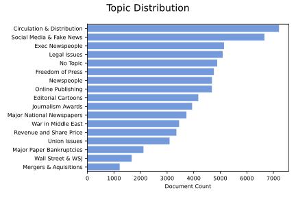

# U.S. Newspaper Publishing Industry NLP Analysis

#### Using natural language processing to examine issues being faced by a struggling industry

Max Currier

## Background

Newspaper publishing is a severely struggling industry. After the advent of the internet age, many papers were unable to adapt their business models quickly enough, and the industry outright collapsed in 2006. Subsequent financial crises in 2008 and 2020 have crippled many newspapers, small and large.

## Methodology

The goal of this project is to **investigate newspaper publishing trade magazine articles as a means to analyze key issues** facing a struggling industry.

To accomplish this, I **use natural language processing techniques to categorize content types** of articles that appear in [Editor & Publisher Magazine](http://editorandpublisher.com/) articles over time and **quantify concern with these topics over time**.

## Methodology

The workflow for this project was:

1. Scraping with BeautifulSoup

2. Pre-processing with NLTK

3. Vectorization with TF-IDF (in AWS)

4. Dimensionality Reduction with NMF (in AWS)

5. Visualization with Seaborn and Tableau

## Key Metric: Topic Strength

As you can see above, articles/year were not uniformly distributed over the 27 years I am examining. To account for this I normalized topic distribution data to account for inconsistent annual publishing rate.

As a result, the key metric I use in my analysis is **topic strength**, aka the % of articles per year in each topic.

## Topic Modeling

For this project I was able to scrap 69,848 articles published over 27 years. Articles were categorized according to their single strongest topic correlation, represented by the following t-SNE visualization

Here's another look at the overall distribution of topics in the corpus.

## Results Dashboard

I built this interactive Tableau dashboard to display the results of my topic-modeling time-series analysis. You can see a [video of me demoing it here](https://drive.google.com/file/d/1yiYviTBQvyOtL8GwmdRBP7VkFh92x5ed/view?usp=sharing)! The dashboard allows you to drill down on specific topics or even combine topics, and the tooltips on each bar will point you to individual articles that were published in the specified year and categorized as that topic, which is personally my favorite part to play with.

 Here are some stills from it as well for your convenience:

I also broke out separate Tableau dashboards for several individual topics (revue, circulation, and online publishing) where I compare topic strength trends with real world trends in publishing company revenue, actual paper circulation figures, and internet usage. These are complete with the same tooltips that allow a user to link to articles published in these topics each year.

## Key Takeaways

These dashboards all allow the user to track how much the industry was talking about key issues over time and map them against real world phenomena. In this way, it is possible to quantify the industry's concern with these key issues and contextualize them to rationalize these levels of concern.

My analysis found that trending topics were closely aligned to actual business conditions. Looking forward, we can see that the growth in topic strength for social media, fake news, and freedom of the press indicates that these issues will be of increasing importance to the U.S. newspaper publishing industry.

## Tools
* Jupyter Notebook
* Tableau
* Pandas
* Numpy
* NLTK
* Scikit-learn
* BeuatifulSoup
* Matplotlib
* Seaborn
